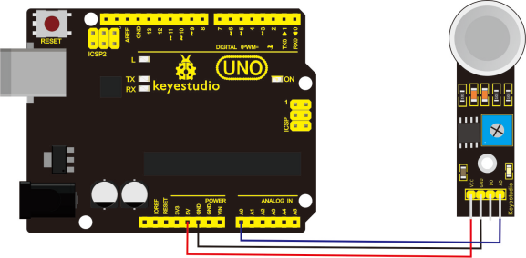
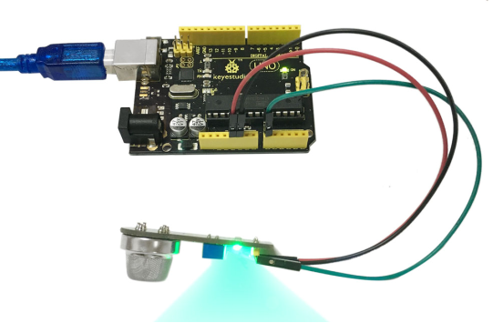

# KS0044 keyestudio MQ-6 Gas Sensor


## 1. Introduction

The gas sensitive material used in MQ-6 gas sensor is SnO2, which is of lower electrical conductivity in clean air.

When there is combustible gas in the environment where sensor resides, the electrical conductivity of the sensor increases with the increase of the combustible gas concentration in the air.

The change of electrical conductivity can be converted to the output signal corresponding to that of the gas concentration by using a simple circuit.

The sensitivity of MQ-6 gas sensor to propane, butane and liquefied petroleum gas is quite high, and the natural gas can also be well detected.

This sensor can detect a variety of combustible gases, making it a low-cost sensor for a variety of applications.

## 2. Feature

- good sensitivity to combustible gas in a wide range of concentrations.
- high sensitivity to propane, butane and liquefied petroleum gas.
- long service life, low cost
- simple drive circuit

## 3. Specification

- Product model: MQ-6
- Target gas: liquefied gas, iso-butane, propane, LPG
- Detectable concentration: 300-10000ppm (propane, butane and liquefied gas)
- Operating voltage: 5V
- Heating voltage: VH 5.0V±0.2V ACorDC
- Load resistance: RL adjustable
- Heating resistance: RH 31Ω±3Ω(Room temperature)
- Heating power: ≤900mW
- Concentration slope: α ≤0.6(R2000ppm/R1000ppm LPG)
- Temperature; humidity: 20℃±2℃；65%±5%RH
- Standard test circuit: Vc:5.0V±0.1V；VH: 5.0V±0.1V
- Preheat time: ≧ 48H

## 4. Application

- household gas leak alarm
- Industrial-level combustible gas alarm
- Portable gas detector

## 5. Connection Diagram



## 6. Sample Code

Download code:  [Code](./Code.7z)

```
void setup() 
{
  Serial.begin(9600);
}

void loop() 
{
  int sensorValue = analogRead(A0);
  Serial.println(sensorValue, DEC);
}
```

